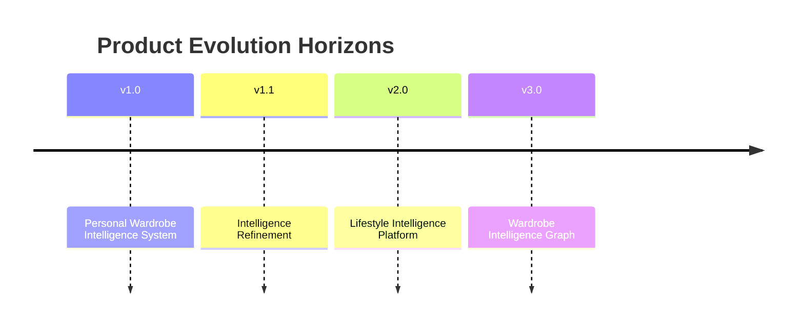
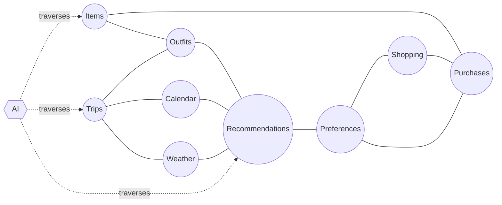
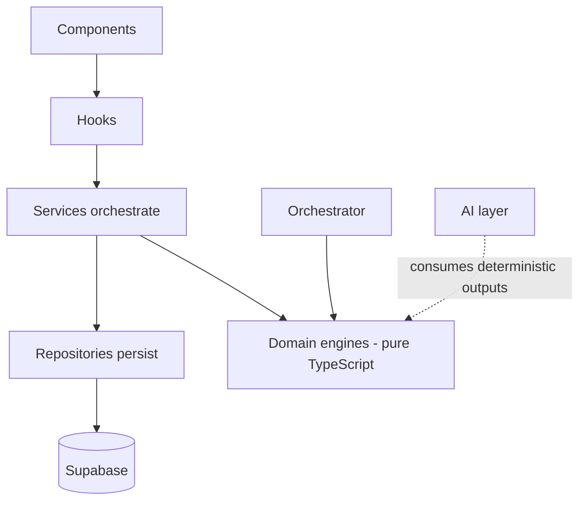
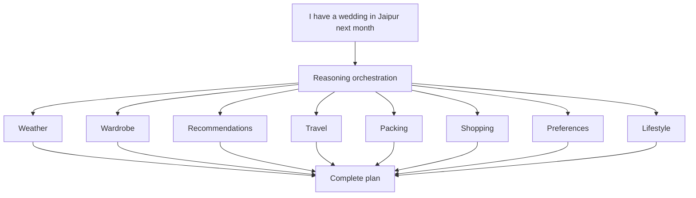

# Wardrobe OS — Product Vision

|              |                                                   |
| ------------ | ------------------------------------------------- |
| **Document** | Long-term Product Vision & Philosophy             |
| **Version**  | v1.0                                              |
| **Status**   | Living document                                   |
| **Author**   | Sanchit Bhatnagar                                 |
| **Architecture Lead** | ChatGPT                                  |
| **Last updated** | 2026-07-08                                    |

> **This is not a roadmap.** It is the long-term vision and philosophy for
> Wardrobe OS — the durable "why" behind the product. For the versioned,
> shippable plan, see [ROADMAP.md](../../ROADMAP.md) and the epic-level
> [BACKLOG.md](BACKLOG.md). The horizons named here (v1.0 → v3.0) are
> **strategic themes**, not release labels, and are intentionally decoupled
> from the shipping cadence.

---

## Vision Statement

Wardrobe OS is a **deterministic wardrobe intelligence platform**.

Its goal is **not** inventory management. Its goal is **helping users make
better wardrobe decisions**. Inventory is only one source of information among
many.

Four commitments anchor everything that follows:

- **Every recommendation is explainable.**
- **Business logic owns decisions.**
- **AI owns explanation.**
- **Providers are interchangeable runtimes.**

The direction of travel never reverses. Deterministic engines produce trusted
outputs; AI makes those outputs legible and conversational. AI is never the
thing that decides.

---

## Product Philosophy

Six core principles govern how Wardrobe OS is built and how it evolves.

### 1. Deterministic First

Business rules always decide. AI never decides. Scoring, eligibility, hard
filtering, wardrobe health, ranking, cost-per-wear, and purchase guidance are
computed by pure, testable engines — not inferred by a model.

### 2. Explainability

Every recommendation should be explainable. Every score should carry its
reasons. A number the user cannot interrogate is a number the user cannot
trust.

### 3. Composable Engines

Every capability is reusable. Business logic is written once and composed —
never duplicated across features. New capabilities are assembled from existing
engines wherever possible.

### 4. Provider Agnostic

OpenAI, Gemini, Claude, and local models are **interchangeable runtimes** behind
a vendor-neutral abstraction. No architectural decision is allowed to depend on
a single provider.

### 5. User Behaviour is Truth

Understanding flows in one direction only:

Behaviour reveals preferences; preferences shape recommendations. **Never the
reverse** — the system does not manufacture preferences to justify a
recommendation. What the user actually does is the ground truth.

### 6. Platform Before Features

Shared capabilities are built before isolated features. Wardrobe OS invests in
the platform first, so that each new feature is a thin composition over durable
foundations rather than a silo.

---

## Product Evolution

Wardrobe OS matures across four strategic horizons. Each horizon deepens the
system's intelligence rather than merely widening its surface area.

### v1.0 — Personal Wardrobe Intelligence System

**Focus:** daily wardrobe decisions.

**Capabilities:** Today · Inventory · Outfits · Analytics · Recommendation ·
AI Stylist · Vision · Shopping · Personalization · Lifestyle.

The foundation: a personal system that catalogues what you own, understands how
you use it, scores and generates outfits, and explains its guidance in natural
language. The **Today** home is where it all converges — one assistant-style
front door that composes every engine into the day's answer, so the system feels
like a single assistant rather than a set of separate tools.

### v1.1 — Intelligence Refinement

Sharpen, don't sprawl. This horizon refines the engines that already exist:

- **Weather Runtime — shipped** (RFC-011): a provider-agnostic runtime that is the
  single deterministic weather source. Weather is *data* (a normalized
  `WeatherSnapshot`); the engines decide, and AI explains — including explaining
  the seasonal fallback when live weather is unavailable, never hallucinating it.
- Recommendation Engine v2
- Personalization v2
- Insights v2
- AI Runtime v2 — provider benchmarking, cost analytics, prompt versioning
- Performance, accessibility, and search improvements
- Theme polish

### v2.0 — Lifestyle Intelligence Platform

Wardrobe OS grows beyond the closet into the contexts a wardrobe serves. Planned
scope and the full "will / might / won't" reasoning live in
[FUTURE.md](FUTURE.md):

- **Travel Intelligence (RFC-017) — the first v2.0 feature.** Packing, capsule
  wardrobes, business trips.
- **Shopping Intelligence (RFC-018)** — wishlist, shopping strategy, wardrobe ROI,
  duplicate detection, purchase prioritization. _(Budget planning dropped — a
  single owner doesn't need a budgeting tool.)_
- **Vision Intelligence v2 (RFC-019)** — closet scan, duplicate detection,
  assisted outfit recognition. _(Laundry detection deferred.)_

**Parked / absorbed** (see [FUTURE.md](FUTURE.md)):

- **Calendar Intelligence (RFC-016)** — parked; low ROI for a single-user app.
- **Higher-order reasoning** (cross-engine orchestration, long-horizon planning,
  multi-step reasoning; RFC-020/021) — already delivered or absorbed by the
  Intelligence Orchestrator (RFC-005), AI Runtime v2 (RFC-014), and Personalization
  v2 (RFC-013).

### v3.0 — Wardrobe Intelligence Graph

Everything becomes connected. Items, outfits, trips, purchases,
recommendations, preferences, shopping, weather, calendar, and AI stop being
separate modules and become **nodes in one graph**.

The graph becomes the source of truth. Future reasoning traverses the graph —
deterministically — and AI explains what the traversal found.

---

## Product Boundaries

Wardrobe OS is defined as much by what it refuses to become. It **intentionally
avoids**:

- Social feeds
- Influencer features
- Community
- Random AI chat
- Notifications
- Browser extensions
- ML-first recommendations
- Business logic inside LLMs

These are not backlog items awaiting priority. They are out of scope by design,
because each one would erode the product's core promise: trusted, explainable,
deterministic guidance.

---

## AI Strategy

AI is a first-class capability with a **strictly bounded mandate**. It makes the
system legible; it never makes the system's decisions.

| AI **owns**            | AI **never** does |
| ---------------------- | ----------------- |
| Explanation            | Scoring           |
| Conversation           | Ranking           |
| Summarization          | Eligibility       |
| Vision understanding   | Decision making   |
| Natural language       | Planning          |

Everything in the right-hand column belongs to deterministic engines. This
boundary is not a temporary limitation of today's models — it is a permanent
architectural principle. When models get better, they get better at
*explaining*; they do not get promoted to *deciding*.

---

## Architecture Philosophy

The architecture exists to keep the philosophy enforceable.

- **Feature-first architecture** — components → hooks → services →
  repositories.
- **Domain-first business logic** — pure, deterministic engines with no I/O.
- **Services orchestrate** repositories and engines.
- **Repositories persist** — the only layer that touches the database.
- **AI consumes deterministic outputs** — it reads engine results; it does not
  replace them.
- **The Orchestrator composes engines** — resolving dependencies and running
  capabilities together without holding business logic of its own.

---

## Future AI Runtime

As AI usage scales, the runtime itself becomes a platform capability. The
long-term AI runtime provides:

- Capability routing
- Provider routing
- Fallback providers
- Cost optimization
- Prompt versioning
- Prompt benchmarking
- Latency metrics
- Structured outputs

The intent is durable independence from any single vendor, with observable cost
and quality — so provider choice is an operational decision, never an
architectural one.

**Status (RFC-014 / RFC-014A):** capability routing, provider routing, fallback
providers, prompt versioning/benchmarking, latency + cost metrics, and structured
outputs are **shipped** in the AI Runtime (`src/runtime/ai`). Two real providers
are wired — **OpenAI** (primary for text/reasoning) and **Gemini** (fallback, and
primary for vision); Claude remains a stub. The runtime falls back to Gemini
automatically when the OpenAI key is absent, proving the "provider is an
operational decision" intent end-to-end.

---

## Product Definition

**Wardrobe OS is NOT:**

- An inventory app.
- A fashion app.
- An AI chatbot.

**Wardrobe OS IS:**

> A deterministic wardrobe intelligence platform that uses AI to **explain,
> educate, and guide** wardrobe decisions.

---

## Long-term Goal

One day, a user should be able to say:

> "I have a wedding in Jaipur next month."

…and Wardrobe OS should reason across every relevant dimension automatically —
without the user manually navigating through modules — and return a complete
plan.

The reasoning is deterministic; the delivery is conversational. This is the
graph vision made concrete: a single intent, resolved by traversing everything
the system knows, and explained in plain language.

---

## Future Ideas

Candidate directions that fit the vision and may earn a place on the roadmap:

- Knowledge Graph
- Semantic Search
- Wardrobe Timeline
- Wardrobe Evolution
- Wardrobe ROI
- Style Journey
- Season Simulator
- Wardrobe Simulator
- Decision Replay
- AI Coach

---

## Rejected Ideas

Directions deliberately declined, because they conflict with the product's
principles or offer low ROI for a single-user product (full status in
[FUTURE.md](FUTURE.md)):

- Browser Extension
- Notifications
- Budget Planning _(dropped from Shopping Intelligence — cost-per-wear + Wardrobe
  ROI already give the money signal)_
- Social Features
- Community
- Fashion Feed
- AI deciding scores
- Model-specific architecture

---

## Success Metric

Wardrobe OS succeeds when the user no longer needs to ask:

> "What should I wear?"

Instead, they open the app, receive trusted guidance, and make better wardrobe
decisions with confidence.
