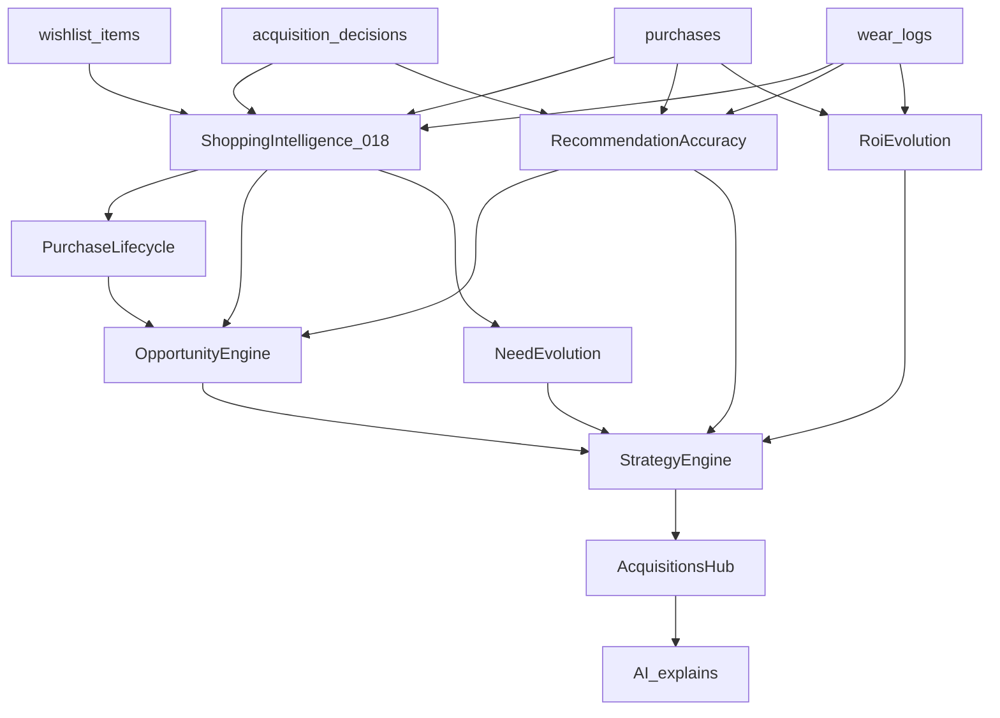

# RFC-018B: Acquisitions Intelligence

Status: Implemented
Owner: Sanchit Bhatnagar
Author: Cursor (Grok)
Target Release: v2.0.0
Epic: Acquisitions
Priority: High
Effort: L
Dependencies:
- RFC-018 Shopping Intelligence (`src/domain/shopping`, `/acquisitions/intelligence`) — base rank/aggregate over Buy vs Skip; **reuse, do not duplicate** PriorityEngine / ROIEngine / DuplicateEngine / ShoppingEngine
- Acquisitions product hub (`/acquisitions` — wishlist, decisions, timeline, ROI, history) — UX shell this RFC evolves into a living intelligence surface
- RFC-001 Acquisition Engine / Buy vs Skip — per-item decisions; `acquisition_decisions` snapshots for accuracy
- RFC-004 / RFC-013 Personalization — taste + gaps feed **Need Evolution**
- RFC-012 Recommendation Engine v2 — outfit potential already in acquisition impact; future Opportunity consumer
- RFC-015 Intelligence Center — future consumer of Opportunity Queue `buy` actions
- RFC-019 Vision Intelligence v2 — optional capture path into wishlist (not required for 018B math)
- ADR-005 (AI does not decide), ADR-008 (release/versioning)

> **Letter-suffix evolution of RFC-018** (same pattern as RFC-014B over RFC-014).
> Shopping Intelligence evaluates and ranks the *current* wishlist. Acquisitions
> Intelligence **learns from purchasing outcomes** — lifecycle, recommendation
> accuracy, need/ROI evolution, opportunity ranking, and a **dynamic** shopping
> strategy. It does **not** replace RFC-018. Acquisition still decides each item;
> Shopping Intelligence still ranks; AI explains.

> **Grounding note:** partial seeds already exist in the hub —
> `recommendationAccuracy.ts`, `AcquisitionTimeline.ts`, and static
> `ShoppingDashboard.strategy`. This RFC formalises and extends them into a
> continuous learning loop.

---

## Acquisitions Intelligence Philosophy

- **RFC-018 evaluates and ranks** the current wishlist (Need × Impact × Buy,
  ROI snapshot, duplicates, static strategy steps).
- **RFC-018B learns from outcomes** — what was recommended (buy/consider/skip),
  what was bought or dismissed, what was worn, and whether realized ROI justified
  the call.
- **Acquisition still decides** each prospective item (RFC-001).
- **Shopping Intelligence still ranks** the active queue (RFC-018).
- **018B adds evolution** — lifecycle stages, accuracy over time, need/ROI
  timelines, opportunity scores, and a strategy that **changes** as wears and
  outcomes accumulate.
- **AI explains** — narrates accuracy, strategy shifts, and opportunity reasons;
  never scores or ranks.

So:

```
Wishlist
  → Shopping Intelligence (RFC-018)
  → Purchase Lifecycle
  → Recommendation Accuracy
  → Opportunity Engine
  → Strategy Engine
  → Acquisitions Insights
```

Deterministic end to end. No duplicated Buy vs Skip or Priority engines.

---

## 1. Problem Statement

Shopping Intelligence (RFC-018) and the Acquisitions hub can evaluate and
surface purchases well: wishlist CRUD, decision history, a priority queue, ROI
cards, and a basic timeline. But the system is still largely **point-in-time**:

- **No continuous lifecycle.** Hub timeline stages stop at a coarse
  Wishlist → Analysis → Purchase → First Wear → ROI. There is no formal path
  through Established / Low Usage / Retired, and no learning when a “buy”
  recommendation becomes a low-use purchase.
- **Accuracy is shallow.** `computeRecommendationAccuracy` only checks
  buy→purchased / skip→dismissed by name match. It does not ask whether the
  item was *worn*, what ROI resulted, or whether the recommendation was *correct
  in hindsight*.
- **Need and ROI do not evolve.** Gap-driven Need and wardrobe ROI are recomputed
  snapshots; there is no Need Timeline or ROI Timeline that shows how the
  wardrobe’s purchase quality changed over months.
- **Strategy is static.** RFC-018’s `strategy` is “top-N of today’s priority
  queue.” It does not update when outcomes prove certain categories overbought
  or underused (“stop buying white shirts,” “focus on bottoms”).
- **No opportunity ranking beyond 018 priority.** User priority on the hub and
  engine priority on intelligence are separate; there is no single
  **Opportunity Score** that folds outcome learning back into what to pursue
  next.

Acquisitions should become a **living intelligence system**: same engines,
continuous feedback from decisions → purchases → wears → ROI.

## 2. Goals

Add intelligence **on top of** existing Acquisitions / Shopping Intelligence.
**No replacement. Only evolution.**

1. **Purchase Lifecycle** — formal states from wishlist through analysis,
   purchase, first wear, established use, low usage, and retirement; derived
   from wishlist + decisions + purchases + wear logs.
2. **Recommendation Accuracy** — deepen outcome tracking:
   Recommended Buy → Actually Bought → Actually Worn → ROI → Was the
   recommendation correct?
3. **Need Evolution** — Need Timeline: how category/gap need changes as items
   are bought and worn (compose Health + 018 Need, do not reimplement Health).
4. **Opportunity Score** — rank what to pursue next using 018 scores **plus**
   lifecycle stage, accuracy context, and evolving need (no second PriorityEngine).
5. **ROI Evolution** — ROI Timeline: realized CPW / utilization over time, best
   and worst cohorts (categories / formality bands), not only a single score.
6. **Dynamic Shopping Strategy** — strategy statements that regenerate from
   outcomes (delay low-impact buys, focus underfilled slots, stop repeating
   low-ROI categories) — distinct from RFC-018’s static top-N list.

## 3. Non-Goals

- **Price tracking** / deal alerts
- **Budgets** / spend caps (already rejected for RFC-018)
- **Marketplace integration**
- **Browser extension**
- **OCR**
- **Reimplementing** BuyVsSkipEngine, PriorityEngine, DuplicateEngine, or ROIEngine
- **Replacing** `/acquisitions/intelligence` or rewriting RFC-018
- **AI-ranked opportunities** — ranking stays deterministic

## 4. User Stories

- As the owner, I want to see whether past Buy vs Skip “buy” calls actually led
  to worn, high-ROI pieces, so I trust (or calibrate) the system.
- As the owner, I want a purchase lifecycle view so I know what is stuck on the
  wishlist, what I bought but never wore, and what has become established.
- As the owner, I want need and ROI to show *change over time*, not only today’s
  snapshot.
- As the owner, I want an Opportunity Queue that blends today’s shopping priority
  with what outcomes say I should pursue or delay.
- As the owner, I want shopping strategy advice that updates when my wardrobe
  fills gaps or accumulates low-use buys — not a frozen top-5 list.
- As the owner, I want optional AI narration of accuracy and strategy shifts,
  while scores remain engine-owned.

## 5. UX Flow

Preserve the split:

| Surface | Role |
| --- | --- |
| `/acquisitions` | Hub KPIs + cards (extend with Accuracy, Opportunity, Strategy, Lifecycle) |
| `/acquisitions/timeline` | Evolve into full **Purchase Lifecycle** (018B states) |
| `/acquisitions/history` | Deepen **Recommendation Accuracy** (bought → worn → ROI → correct?) |
| `/acquisitions/roi` | Add **ROI Evolution** timeline alongside snapshot score |
| `/acquisitions/intelligence` | Unchanged RFC-018 tabs (Priority / Duplicates / Strategy snapshot) |
| New or hub panel | **Opportunity Queue** + **Dynamic Strategy** + **Need Timeline** |

Suggested flow:

1. User continues to capture wishlist / run Buy vs Skip (silent decision snapshots).
2. Hub loads 018 dashboard once + decisions + purchases + wears.
3. 018B domain derives lifecycle, accuracy, need/ROI timelines, opportunity queue,
   dynamic strategy.
4. User reviews Opportunity Queue and Strategy; optionally asks AI to explain.
5. No automatic purchases or inventory writes.

Label UI clearly: **“Queue (today)”** = RFC-018 priority; **“Strategy (learned)”**
= RFC-018B dynamic strategy — avoid confusion.

## 6. Architecture

### Domain Layer

Prefer extending `src/domain/shopping/` (or a thin `src/domain/acquisitions-intelligence/`
that **only imports** shopping/acquisition types — never copies scoring). Pure
TypeScript; time injected.

| Module | Responsibility |
| --- | --- |
| `LifecycleEngine` | Map subjects → Purchase Lifecycle states (extend `AcquisitionTimeline`) |
| `AccuracyEngine` | Extend `recommendationAccuracy.ts` with wear + ROI correctness |
| `NeedEvolution` | Build `NeedTimeline` from health gaps + purchase/wear events over time |
| `RoiEvolution` | Build `RoiTimeline` + cohort summaries from purchases/wears |
| `OpportunityEngine` | Score opportunities from 018 `ShoppingRecommendation` + lifecycle + need |
| `StrategyEngine` | Emit dynamic `ShoppingStrategy` rules from outcomes (not static top-N) |
| Composer | `buildAcquisitionsIntelligence(...)` → single insights object |

**Rules:** reuse `buildShoppingDashboard` / `evaluateWithContext` outputs; never
re-score buy/skip; never reimplement Need × Impact × Buy.

### Service Layer

`src/features/shopping` (or acquisitions) service: load wishlist, decisions,
acquisition context (purchases/wears), call `getShoppingDashboard()` once, run
018B composer, return `{ data, error }`.

### Repository Layer

Reuse existing: `wishlist_items`, `acquisition_decisions`, `purchases`,
`wear_logs`. No new repository required for Draft v1 if all outputs are derived.

### UI Layer

Extend Acquisitions hub components; keep intelligence route as 018. Optional
command-palette entries for Opportunity / Lifecycle later.

### AI Layer

Optional explain tools for accuracy summary and strategy narrative — consume
018B outputs; never adjust Opportunity Score or accuracy %.

## 7. Data Flow



## 8. Data Model / Schema Impact

**No required schema for Draft v1.** All 018B views recompute from:

- `wishlist_items` (status, priority, timestamps)
- `acquisition_decisions` (decision snapshots)
- `purchases` + `wear_logs` (realized ROI / wears)

**Optional later (document only — do not apply in this RFC authoring):**

```sql
-- OPTIONAL future: explicit outcome link (if name-matching proves fragile)
-- alter table acquisition_decisions
--   add column if not exists outcome_item_id uuid,
--   add column if not exists outcome_kind text; -- purchased | dismissed | ignored
```

RLS: any additive columns follow existing anon MVP policies. Prefer improving
matching (normalized name + category) before new columns.

## 9. API / Domain Contracts

### Outputs

```ts
type PurchaseLifecycleState =
  | "wishlist"
  | "analyzed"
  | "bought"
  | "first_wear"
  | "established"
  | "low_usage"
  | "retired";

interface PurchaseLifecycle {
  subjects: {
    id: string;
    name: string;
    state: PurchaseLifecycleState;
    statesReached: PurchaseLifecycleState[];
    decision: "buy" | "consider" | "skip" | null;
    wears: number;
    costPerWear: number | null;
  }[];
}

interface RecommendationAccuracyReport {
  sampleSize: number;
  hits: number;
  accuracyPercent: number | null;
  /** buy→bought→worn→acceptable ROI */
  deepSampleSize: number;
  deepHits: number;
  deepAccuracyPercent: number | null;
  cases: {
    decisionId: string;
    itemName: string;
    decision: "buy" | "consider" | "skip";
    bought: boolean;
    worn: boolean;
    costPerWear: number | null;
    correct: boolean | null; // null if unscored (e.g. consider)
  }[];
}

interface NeedTimeline {
  points: { date: string; category: string | null; needScore: number }[];
}

interface RoiTimeline {
  points: { date: string; wardrobeRoiScore: number; averageCostPerWear: number | null }[];
  bestCategories: { category: string; score: number }[];
  worstCategories: { category: string; score: number }[];
}

interface OpportunityItem {
  id: string; // wishlist id
  name: string;
  opportunityScore: number; // 0–100
  reasons: string[];
  fromPriority: number; // RFC-018 priority
  lifecycleState: PurchaseLifecycleState;
}

type OpportunityQueue = OpportunityItem[];

interface ShoppingStrategyRule {
  code: string; // e.g. DELAY_LOW_IMPACT, FOCUS_BOTTOMS, STOP_CATEGORY
  message: string;
  severity: "info" | "warn";
  evidence: string[];
}

interface DynamicShoppingStrategy {
  rules: ShoppingStrategyRule[];
  generatedAt: string;
}

interface AcquisitionsIntelligence {
  lifecycle: PurchaseLifecycle;
  accuracy: RecommendationAccuracyReport;
  needTimeline: NeedTimeline;
  roiTimeline: RoiTimeline;
  opportunityQueue: OpportunityQueue;
  strategy: DynamicShoppingStrategy;
  metadata: { version: string; generatedAt: string };
}
```

### Functions (illustrative)

```ts
buildPurchaseLifecycle(input): PurchaseLifecycle
buildRecommendationAccuracyReport(input): RecommendationAccuracyReport
buildNeedTimeline(input): NeedTimeline
buildRoiTimeline(input): RoiTimeline
scoreOpportunities(dashboard: ShoppingDashboard, lifecycle, need): OpportunityQueue
buildDynamicStrategy(accuracy, roi, need, opportunity): DynamicShoppingStrategy
buildAcquisitionsIntelligence(...): AcquisitionsIntelligence
```

Opportunity Score composes existing 018 priority with lifecycle/need modifiers
(weights documented at implementation time; see §14). It must **not** call
`evaluateBuyVsSkip` again per item if the dashboard already holds analyses.

## 10. Acceptance Criteria

- [x] Purchase Lifecycle derived for wishlist/purchase subjects (including
      established / low_usage / retired bands)
- [x] Recommendation Accuracy supports shallow + deep (bought → worn → ROI) views
- [x] Opportunity Queue ranked deterministically from 018 + lifecycle/need
- [x] Need Evolution timeline produced
- [x] ROI Evolution timeline + cohort summaries produced
- [x] Dynamic Shopping Strategy regenerates from outcomes (distinct from 018 static top-N)
- [x] Reuses RFC-018 engines; no duplicated Buy vs Skip / Priority scoring
- [x] Fully deterministic with injected time; AI explains only
- [x] Domain under `src/domain/shopping/v2/`; hub + Developer Mode surfaces; tests green

## 11. QA / Testing Plan

- Vitest for lifecycle state machine, accuracy deep/shallow cases, opportunity
  ordering, strategy rule emission (fixture dashboard + decisions + wears)
- No live Gemini/OpenAI in tests
- Manual hub preview after implementation: Accuracy / Lifecycle / Opportunity /
  Strategy panels vs `/acquisitions/intelligence` static strategy

## 12. Risks & Trade-offs

| Risk | Mitigation |
| --- | --- |
| Sparse early outcomes → empty accuracy / weak strategy | Show “—” / sample-size gates; never invent hits |
| Confusing 018 static strategy vs 018B dynamic strategy | Distinct labels and routes/panels |
| Name-matching fragility for decision↔purchase | Prefer purchased_id / outcome fields later (§8 optional) |
| Over-weighting Opportunity vs 018 Priority | Document weights; keep 018 priority visible as `fromPriority` |

## 13. Future Extensions

- Vision-fed opportunities (RFC-019 detections → wishlist → opportunity)
- Trip-demand coupling (RFC-017 packing gaps boost Opportunity Score)
- Intelligence Center actions sourced from Opportunity Queue
- Embedding-based duplicate/opportunity signals (when Vision embeddings exist)
- Persisted lifecycle annotations if derived state is insufficient

## 14. Open Questions

1. **Persist lifecycle state vs fully derived?** Draft default: **fully derived**
   from existing tables (simpler, no migration).
2. **Opportunity Score weight defaults?** Need proposal at Approve time
   (e.g. 018 priority 60% + need evolution 20% + lifecycle urgency 20%).
3. **Where does Dynamic Strategy live in nav?** Hub panel vs dedicated
   `/acquisitions/strategy` — default: hub panel + history/ROI deep links.
4. **Deep accuracy ROI threshold?** What CPW / utilization counts as
   “recommendation correct” for a buy — needs Owner calibration before Approve.
