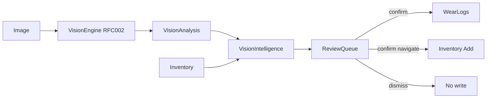

# RFC-019: Vision Intelligence v2

Status: Implemented
Owner: Sanchit Bhatnagar
Author: Cursor (Grok)
Target Release: v2.0.0
Epic: Vision
Priority: High
Effort: XL
Dependencies:
- RFC-002 Vision Engine (`analyzeImage`, `VisionAnalysis`, `DetectedItem`, `StyleDNACandidate`) — perception only; this RFC never reimplements vision
- RFC-003 Shopping Screenshot Understanding — confirmation-before-action pattern; ShoppingImageInterpreter remains the acquisition path
- RFC-018 Shopping Intelligence / Acquisitions hub — optional consumer of visual duplicate warnings when adding wishlist/inventory candidates
- Inventory CRUD (`src/features/inventory`) — confirmed closet-scan adds only
- Wear Logs (`src/features/wear-logs`) — confirmed outfit-recognition logs only
- RFC-005 Intelligence Orchestrator — future capability registration; v1 calls Vision Engine via existing `/api/ai/vision`
- ADR-004 (provider abstraction), ADR-005 (AI does not decide), ADR-006 (caching), ADR-008 (release/versioning)

> **Practical Vision workflows.** Wardrobe OS already understands images
> (RFC-002). Vision Intelligence v2 turns that perception into **closet scan**,
> **assisted outfit recognition**, and **visual duplicate detection** — always
> behind a **review queue**. Vision detects; the user confirms; AI may explain.
> Never auto-add. Never auto-log wear.

---

## Vision Intelligence Philosophy

- **Vision detects** (RFC-002). `VisionAnalysis` is observation + confidence.
- **Vision Intelligence interprets workflows.** Pure domain matchers build review
  queues, similarity scores, and outfit proposals from `VisionAnalysis` +
  inventory — no new perception stack.
- **User confirms.** Every inventory add and wear log requires an explicit
  confirm. Dismiss is always available.
- **AI explains.** Optional narration of detections/matches; never writes.

So: **Image → Vision Engine → VisionAnalysis → Vision Intelligence → Review
Queue → (user confirm) → Inventory / Wear Logs / Acquisitions.**

---

## 1. Problem Statement

The Vision Engine understands images, but wardrobe management is still manual:
cataloguing a closet, logging an outfit from a mirror selfie, and spotting
near-duplicates before adding another similar piece all require retyping. We need
**workflows**, not a better recognizer.

## 2. Goals

1. **Closet Scan** — bulk detect garments from a closet photo; compare to
   inventory; produce a review queue (new / possible match / duplicate).
2. **Assisted Outfit Recognition** — mirror selfie → detect clothing → confidence
   → user confirms → wear log (never automatic).
3. **Visual Duplicate Detection** — score detections against inventory (category,
   colour, material, label tokens — attribute similarity grounded in vision
   output; not image embeddings in v1).
4. **Review Queue** — single confirmation surface for pending actions.
5. **Reuse** Vision Engine, inventory listing, wear-log create APIs — **no
   duplicated vision logic**.

## 3. Non-Goals

- Laundry Detection (parked in FUTURE.md)
- Stain Detection / Wear Detection
- Automatic logging or auto-add
- OCR
- Marketplace / shopping browse
- Populating `VisionAnalysis.metadata.embeddings` (reserved; future)

## 4. User Stories

- As the owner, I photograph my closet and review detected items before any are
  added, so bulk cataloguing is fast but safe.
- As the owner, I take a mirror selfie, confirm which inventory pieces I’m
  wearing, and log the wear in one flow.
- As the owner, I am warned when a detection looks like something I already own
  before I add it again.

## 5. UX Flow

| Route | Purpose |
| --- | --- |
| `/vision` | Hub — Closet Scan, Outfit Recognition, Review, Debug |
| `/vision/scan` | Upload image; choose Closet Scan or Outfit mode; run Vision Engine |
| `/vision/review` | Review queue — confirm / dismiss pending actions |
| `/developer/vision` | Vision Debug — raw `VisionAnalysis` + scores (Developer Mode) |

Flow: Upload → Vision Engine (`POST /api/ai/vision`) → Intelligence domain →
Review Queue UI → Confirm (wear log / navigate to add item) or Dismiss.

## 6. Architecture

### Domain Layer

Pure TypeScript under `src/domain/vision-intelligence/`:

- `visualSimilarity` — score detection ↔ inventory item
- `DuplicateVision` — cluster / warn on high similarity
- `ClosetScanner` — classify detections vs inventory → scan result + queue seeds
- `OutfitRecognition` — propose inventory matches per slot for wear logging
- `ReviewQueue` — build / update pending actions (status only; no I/O)

### Service Layer

`src/features/vision/services/` — call existing vision client, load inventory via
existing inventory/acquisition context helpers, run domain, return `{ data, error }`.
Wear-log / inventory writes happen **only** on explicit confirm mutations.

### Repository Layer

No new tables. Reuse inventory + wear-log repositories.

### UI Layer

`src/features/vision/components/` + App Router pages above. Nav: Wardrobe section
gains **Vision**.

### AI Layer

Perception via existing Vision Runtime / Gemini vision provider. Optional
explanation later; not required for v1 acceptance.

## 7. Data Flow

## 8. Data Model / Schema Impact

**No schema changes.** Review queue is session/client state derived from the last
scan. Optional future: `vision_review_sessions` — out of scope.

## 9. API / Domain Contracts

- `scoreVisualSimilarity(detection, inventoryItem): number` (0–1)
- `analyzeVisualDuplicates(analysis, inventory): VisualDuplicateAnalysis`
- `runClosetScan(analysis, inventory): ClosetScanResult`
- `recognizeOutfit(analysis, inventory): DetectedOutfit`
- `buildReviewQueue(...): ReviewQueue`
- `confirmReviewItem` / `dismissReviewItem` — pure status transitions

Feature service orchestrates vision + inventory; never auto-writes.

## 10. Acceptance Criteria

- [x] Closet scan produces classified detections + review queue seeds
- [x] Review queue supports confirm / dismiss (no silent writes)
- [x] Assisted outfit recognition proposes matches for wear-log confirm
- [x] Visual duplicate detection scores against inventory
- [x] No automatic inventory adds or wear logs
- [x] Reuses RFC-002 `analyzeImage` path (no duplicate vision stack)
- [x] Domain unit tests; lint/build green for new code
- [x] Docs: CHANGELOG, ROADMAP, BACKLOG, ENGINE_GRAPH; RFC marked Implemented

## 11. QA / Testing Plan

- Vitest for similarity, closet scan classification, outfit recognition, review
  queue transitions (mocked `VisionAnalysis`, no live Gemini)
- Manual: upload on `/vision/scan`, review on `/vision/review`, confirm wear log
- Developer debug page for raw analysis

## 12. Risks & Trade-offs

- Attribute similarity ≠ true visual embeddings — may miss lookalikes with different
  metadata; embeddings deferred.
- Bulk scan cost/latency — one photo per run in v1.
- False duplicate warnings — confidence + review queue mitigate.

## 13. Future Extensions

- Laundry Detection (parked)
- Embedding-based duplicate index
- Multi-photo closet scan sessions
- Orchestrator `vision_intelligence` capability
- Persist review sessions

## 14. Open Questions

- None blocking for v1 (session-local queue; attribute similarity).
